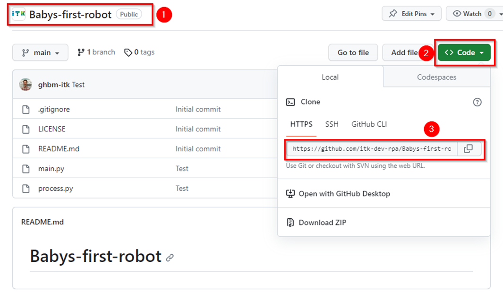
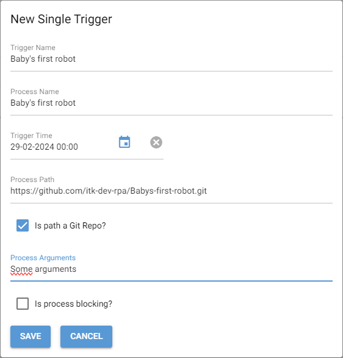
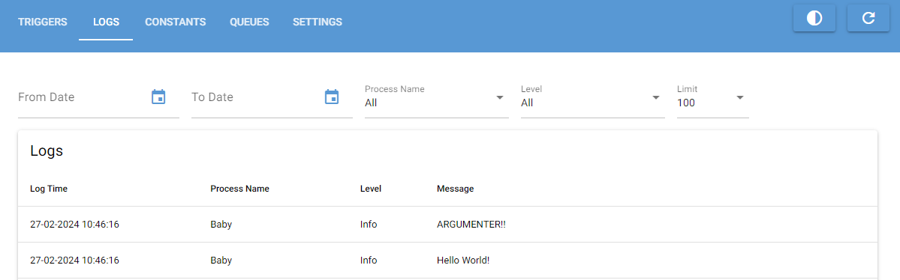

# Baby's First Robot

## Intro

The project **Baby's First Robot** is a bare bones robot that can be
used for testing OpenOrchestrator.

It does a few things when run:

1. Sets up a virtual environment and installs dependencies.
2. Connects to OpenOrchestrator.
3. Creates a log with "Hello World".
4. Creates a log with the arguments passed to the robot.

## How to use

### 1. Get link to Github repository

Go to the repository on [Github](https://github.com/itk-dev-rpa/Babys-first-robot) and get the link to the git repository.

### 2. Create a single trigger in Orchestrator

1. Click "New single trigger".
2. Enter a name for the trigger and process.
3. Enter a date and time to run.
4. Insert the link to the git repository (make sure it ends with ".git").
5. Check "Is path a Git Repo?".
6. Enter some random arguments.
7. Click "Save"

### 3. Start Scheduler

Start the Scheduler application on the computer where you want the robot to run.

### 4. Check the results

Go to the "Logs" tab of Orchestrator and see if the robot created some logs.

