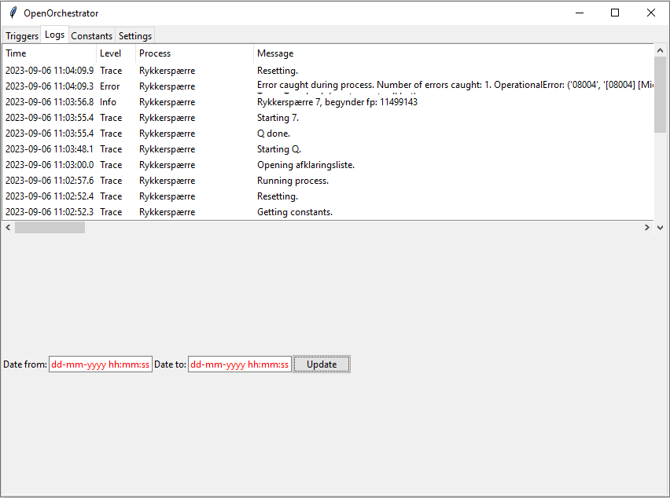
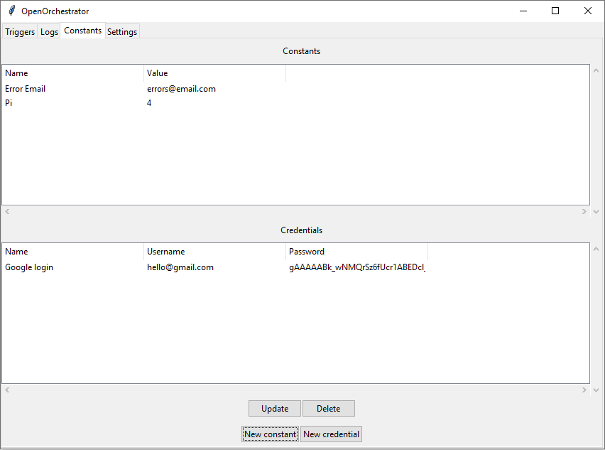

# Orchestrator

The Orchestrator is used by admins to control process schedules,
read logs and edit constants/credentials used by automation processes.

To run Orchestrator make sure OpenOrchestrator is installed and run the following command:

```
python -m OpenOrchestrator -o
```

## Settings

The first step when opening Orchestrator is to go to the settings tab
and establish a connection to the central database.

1. Enter the connection string to the central database here.
2. Click connect to connect using the given connection string. The button will change its text to 'Connected!'
if the connection was successful.
3. Enter the encryption key to be used to encrypt credential passwords.
4. To generate a new encryption key press 'New key'. Remember to save the key, as it will be lost
when Orchestrator is closed.
5. The first time OpenOrchestrator is used you can press 'Initialize Database' to create all the needed
tables in the central database.


## Triggers

The 'Triggers' tab is where the running schedule for the automation processes is defined.

There are 3 different kinds of triggers:
- Scheduled triggers: Run the process at a given interval defined using cron expressions.
- Queue triggers: Run the process when a database queue reaches a minimum number of elements.
- Single triggers: Run the process once at a given date and time.

### Description of the UI:

1. Overview of scheduled triggers.
2. Overview of Queue triggers.
3. Overview of Single triggers.
4. Press 'Update' to update the trigger tables.
5. Select a trigger from 1-3 and press 'Delete' to remove a trigger.
6. Press these buttons to create new triggers. 


### Creating new scheduled triggers

When creating a new scheduled trigger the following pop-up is shown:


Process name: The name of the process. This will be shown in the triggers tab as 
well as any logs created by the process.

Cron expression: The run interval of the process described as a cron expression.
Use the help link if you don't know how to write cron expressions.

Process path: The absolute path to the process on the computer or
a URL to the git repo hosting the process.

Arguments: Arguments to be passed to the process at runtime.
This value is passed as a raw string. It's recommended using a json string for more
complex arguments.

Is git repo: Toggle this on if the process path given is a URL to a git repo.

Is blocking: If this is off the process is allowed to run parallel to other
non-blocking processes. If it's on the process will always run alone
on the worker machine.

### Creating Queue triggers

TODO

### Creating single triggers

When creating a new single trigger the following pop-up is shown:


Process name: The name of the process. This will be shown in the triggers tab as 
well as any logs created by the process.

Trigger date: The date the process should run.

Trigger time: The time on trigger date the process should run.

Process path: The absolute path to the process on the computer or
a URL to the git repo hosting the process.

Arguments: Arguments to be passed to the process at runtime.
This value is passed as a raw string. It's recommended using a json string for more
complex arguments.

Is git repo: Toggle this on if the process path given is a URL to a git repo.

Is blocking: If this is off the process is allowed to run parallel to other
non-blocking processes. If it's on the process will always run alone

## Logs

The 'Logs' tab is where logs created in automation processes are viewed.



The logs are shown in cronological order. 

The logs can be filtered on time, level and process name.

To view log messages that don't fit in the table double click the log to open it in a pop-up window (WIP).

## Constants

The constants tab is where you can view, edit and add constants and credentials used across all processes.



A constant is a simple text value that can be accessed across all processes.

A credential is a username-password pair that can be accessed across all processes.
Passwords are encrypted using AES before being sent to the central database using the encryption key
given under the settings tab. The passwords shown in the table are encrypted.
It's not possible to access unencrypted passwords in the Orchestrator.