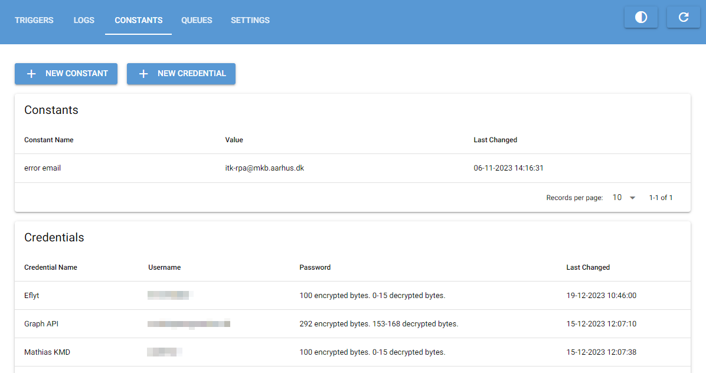

# Constants
{:.no_toc}

## Table of Contents
{:.no_toc}
- TOC
{:toc}

## Intro

The constants tab is where you view, edit and add constants and credentials.

**Constants** are pairs of names and values. Use this to define constants or config values that should be used across
multiple automation processes.

**Credentials** has a name, username and password and are used to store login credentials used in automation
processes in a safe and central location.

---

## Description of the UI

At the top are buttons to create new constants and credentials. Below that are two tables
for viewing existing constants and credentials respectively.



---

## Creating new constants

When creating a new constant the following pop-up is shown:


**Name**: The name of the constant. This must be unique from other constants' names.
If you try to create a new constant with an existing name an error will be shown.

**Value**: The value of the constant. Note that this is a raw string value and will need to be converted by the 
automation process if needed.

---

## Creating new credentials

When creating a new credential the following pop-up is shown:


**Name**: The name of the credential. This must be unique from other credential names.
If you try to create a new credential with an existing name an error will be shown.

**Username**: The username of the credential.

**Password**: The password of the credential. The password is encrypted using the encryption key
defined in the Settings tab before being sent to the database. The value shown in the credentials
table is the number of stored encrypted bytes and an estimate of the number of decrypted bytes.
There is no way to retrieve unencrypted passwords from Orchestrator.

---

## Editing existing constants and credentials

To edit an existing constant or credential simply click it in the table.
Here you can also delete the constant or credential which will permanently remove it from the database.

---

## Complex values and secrets

Since both constants and credentials store their values, usernames and passwords as
raw strings, you can easily insert csv, json or base64 strings into the tables if
your automation processes needs it.

An example could be API credentials where you not only have a password but also a tenant and client id.
This could be inserted into the password field of a credential as a json string:

```json
{"password": "Hunter2", "client_id": "52a8ff3c-0ea0-4e0f-998b-a64803de09b8", "tenant_id": "1c3de1da-f17b-4a00-a833-a4307a08c1a8"}
```

This can then easily be unpacked as part of your automation process and you can store
multiple pieces of related data in a compact manner.
