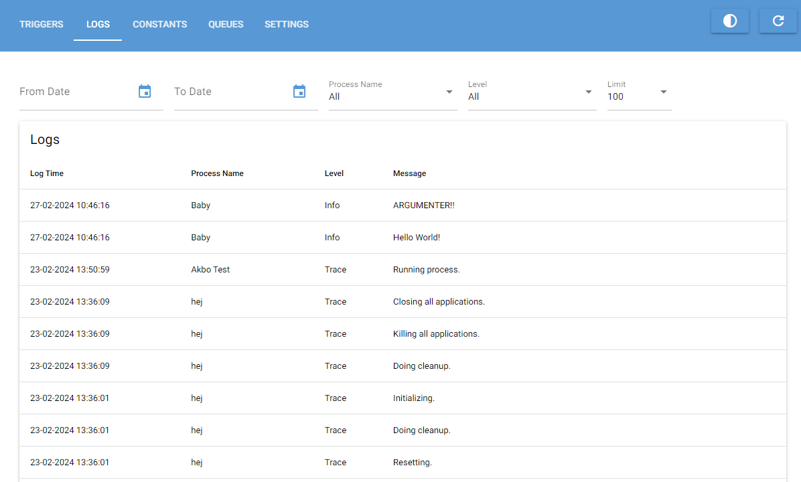

# Logs
{:.no_toc}

## Table of Contents
{:.no_toc}
- TOC
{:toc}

## Intro

The logging tab displays all logs created by automation processes.

A log contains the following information:

**Log time**: The time and date the log was created.

**Log level**: The level the log was created at. There are 3 levels Trace, Info and Error.

**Process Name**: The name of the process that created the log. This is defined on the trigger.

**Message**: The message of the log.

---

## Description of the UI

1. Table of logs.
2. Filter options.
3. Update button.

---

## Filter Options

When retrieving logs it's possible to apply filters to only show relevant logs.
At the moment only 100 logs are fetched. To get to the specific logs you want to see use the filter options.

**Date from**: The date and time where logs should be created at or after.

**Date to**: The date and time where logs should be created at or before.

**Process name**: The name of the process that created the log. The dropdown will
automatically contain all unique process names in the log database.

**Log level**: The level the log was created at. Trace, Info or Error.

---

## Viewing Multiline Logs

To view log messages that don't fit in the table double-click the log to open it in a pop-up window.

It's also possible to copy the text to clipboard by pressing ctrl+c when the pop-up is in focus.
