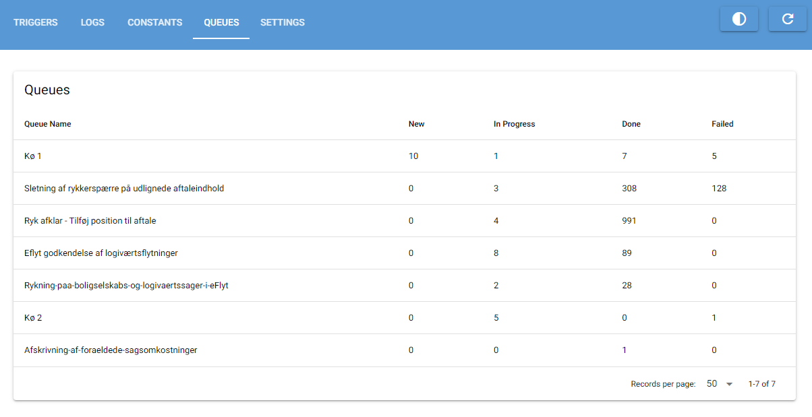

# Queues
{:.no_toc}

## Table of Contents
{:.no_toc}
- TOC
{:toc}

## Intro

In the Queues tab you can inspect the job queues in the database.
It's currently not possible to edit queues from Orchestrator.

---

## Description of the UI

The queues tab contains a single table that displays all queue in the database.
For each queue you can see a count of how many queue elements are in the queue with each
status.

---

## Detailed queue view

To get a more detailed view of the elements in a queue click the queue in the table
which will open the following popup.

At the top of the popup you can choose what columns to display in the table,
how many queue elements to load from the database, and toggle a "dense"
view of the table.

The queue elements are loaded in order of their creation date with the newest first.

In contrast to the rest of the Orchestrator application this popup is **not** updated
every 10 seconds and must be manually updated by clicking the refresh button in the
top right corner of the popup.

---

## Queue elements

A queue element represents a single task to be performed by an automation process.
Queue elements have the following attributes:

**Reference**: The reference of the queue element is a string which can be used to look up the
queue element in an automation process. This could be a case number or something similar.
It doesn't have to be unique.

**Status**: The status describes where the queue element is in the process. The following statuses are
available at the moment: New, In Progress, Done, and Failed. These needs to be set manually as part
of the automation process.

**Data**: This field contains any data needed to process the queue element. What goes here
is specific to each automation process. The data is stored as raw text.

**Message**: When an automation process changes the status of a queue element it's possible
to also attach a message to the queue element. This could be an error message or a description
of the outcome of processing the queue element.

**Created Date**: The date and time when the queue element was added to the queue.

**Start Date**: The date and time when the queue element's status became "In Progress".

**End Date**: The date and time when the queue element's status became "Done" or "Failed".

**Created By**: When creating a queue element it's possible to note who created the queue element.

**ID**: The queue elements unique ID in the database.