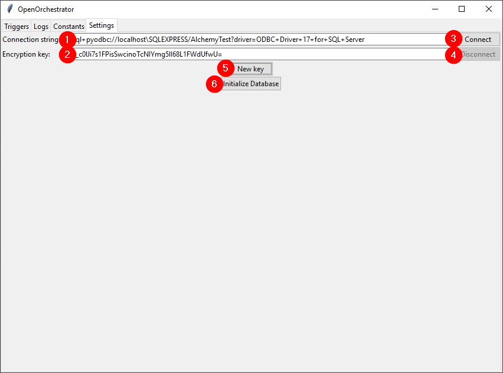

# Settings

The first step when opening Orchestrator is to go to the settings tab
and establish a connection to the central database.

1. Enter the connection string to the central database.
2. Enter the encryption key to be used to encrypt credential passwords.
3. Click connect to connect using the given connection string. The 'Connect' button and text fields will
be greyed out if the connection was successful.
4. To disconnect again press 'Disconnect'.
5. To generate a new encryption key press 'New key'. Remember to save the key, as it will be lost
when Orchestrator is closed.
6. The first time OpenOrchestrator is used you can press 'Initialize Database' to create all the needed
tables in the central database.

**Tip:** Both connection string and encryption key can be filled automatically
if 'OpenOrchestratorConnString' and 'OpenOrchestratorKey' are defined in the environment variables.

