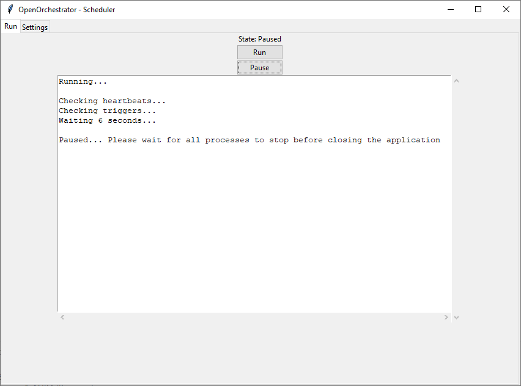

# Scheduler

The Scheduler is run on the worker machines where the automation processes should run.

To run Scheduler make sure OpenOrchestrator is installed and run the following command:

```
python -m OpenOrchestrator -s
```

## Settings

The first step when opening Scheduler is to go to the settings tab
and establish a connection to the central database.

1. Enter the connection string to the central database here.
2. Click connect to connect using the given connection string. The button will change its text to 'Connected!'
if the connection was successful.
3. Enter the encryption key to be used to encrypt credential passwords.

**Tip:** Both values can be filled automatically if 'OpenOrchestratorConnString' and 'OpenOrchestratorKey' are
defined in the environment variables.


## Run

When the connection has been established and the encryption key has been set it's
a simple matter of going to the Run tab and press 'Run'.



When running the Scheduler will run a simple loop every 6 seconds:
1. Check heartbeats of running processes.
2. Check if any triggers in the database should run.
3. Repeat.

When you want the Scheduler loop to stop press 'Pause'.
The Scheduler will continue too check heartbeats of running processes
but it will no longer check the triggers in the database.
