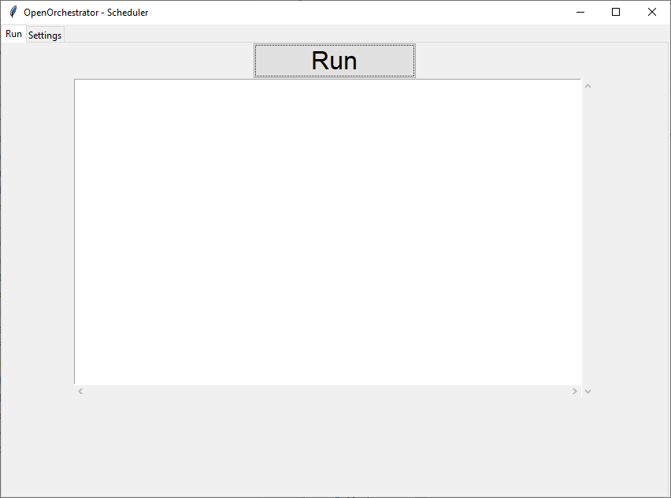

# Run

When the connection has been established and the encryption key has been set it's
a simple matter of going to the Run tab and press 'Run'.

When running the Scheduler will run a simple loop every 6 seconds:
1. Check heartbeats of running processes.
2. Check if any triggers in the database should run.
3. Repeat.

When you want the Scheduler loop to stop press 'Pause'.
The Scheduler will continue too check heartbeats of running processes
but it will no longer check the triggers in the database.
