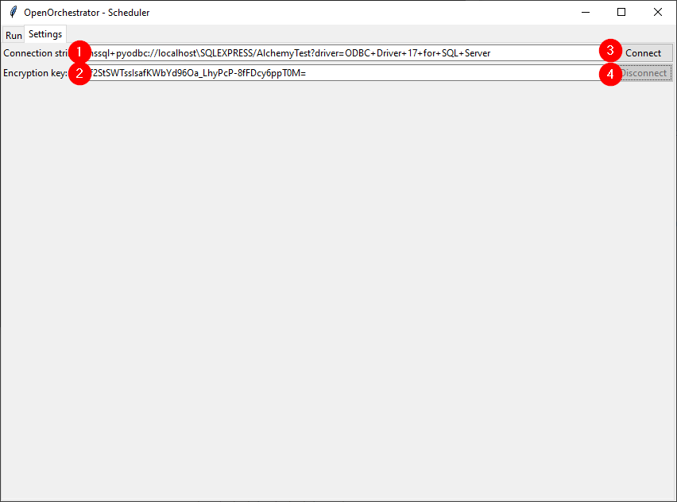

# Settings

The first step when opening Scheduler is to go to the settings tab
and establish a connection to the central database.

1. Enter the connection string to the central database.
2. Enter the encryption key to be used to decrypt credential passwords.
3. Click connect to connect using the given connection string. The 'Connect' button and text fields will
be greyed out if the connection was successful.
4. To disconnect again press 'Disconnect'.

**Tip:** Both connection string and encryption key can be filled automatically
if 'OpenOrchestratorConnString' and 'OpenOrchestratorKey' are defined in the environment variables.

