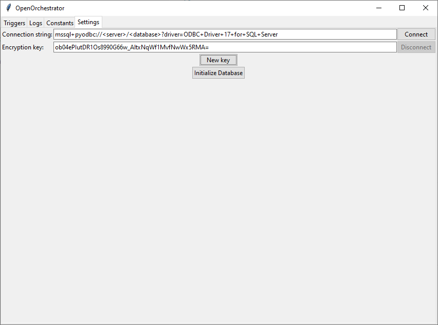

# OpenOrchestrator Setup
{:.no_toc}

## Table of Contents
{:.no_toc}
- TOC
{:toc}

## Install Python

Before you can install OpenOrchestrator you need to have Python installed.
The newest version of Python is recommended but you need at least version 3.10.

Go to [Download Python](www.python.org/downloads) to get the newest version of Python.

---

## Install OpenOrchestrator

To install the newest version of OpenOrchestrator open up a terminal (Command Prompt) and type:

```
pip install OpenOrchestrator
```

Or if you want a specific version e.g. v0.0.1:

```
pip install OpenOrchestrator==0.0.1
```

---

## Setup Orchestrator

When OpenOrchestrator has been installed type the following command into a terminal:

```
python -m OpenOrchestrator -o
```

This will launch Orchestrator and a browser will automatically open a window like this:


**Note**: Even though Orchestrator runs in a browser it's not connected to the internet
other than the OpenOrchestrator database you choose to connect to.

Insert the connection string to the database and generate a new encryption key
by clicking the 'Generate key' button.

**Remember** to write down the encryption key as it must be the same every time
anyone wants to connect to the same database!

Then click the 'Connect' button. The text fields and the 'Connect' button should become greyed out
and a message should say "Connected" indicating the connection was successful.

The first time OpenOrchestrator connects to a freshly installed database you need to press the
'Initialize Database' button. This will setup all the needed tables in the database. Pressing
the button again later should have no effect.
